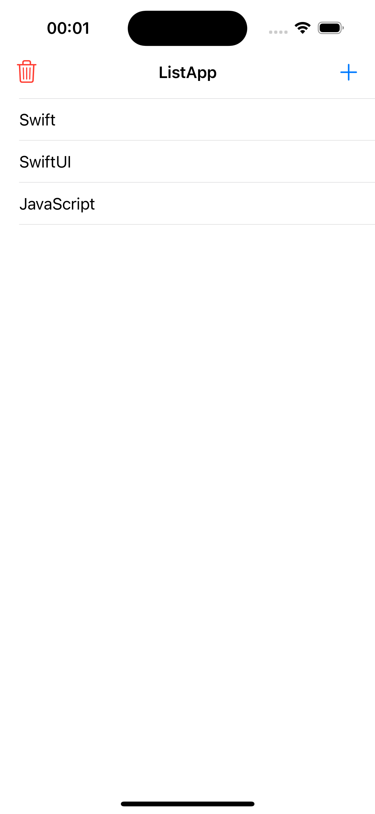
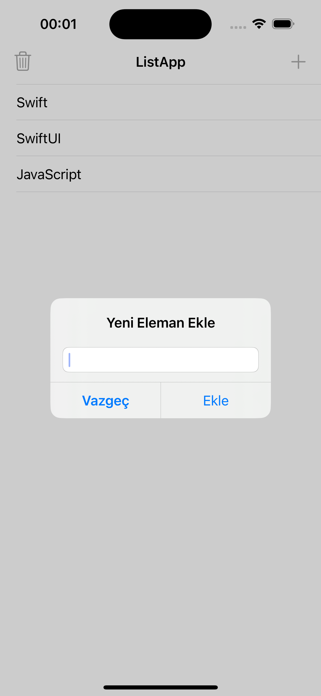
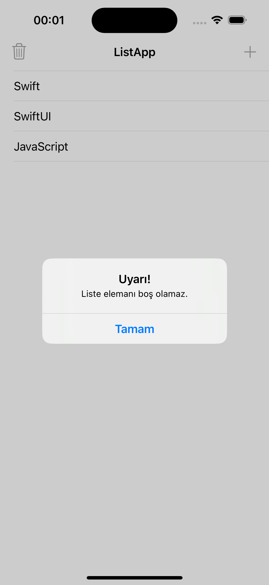
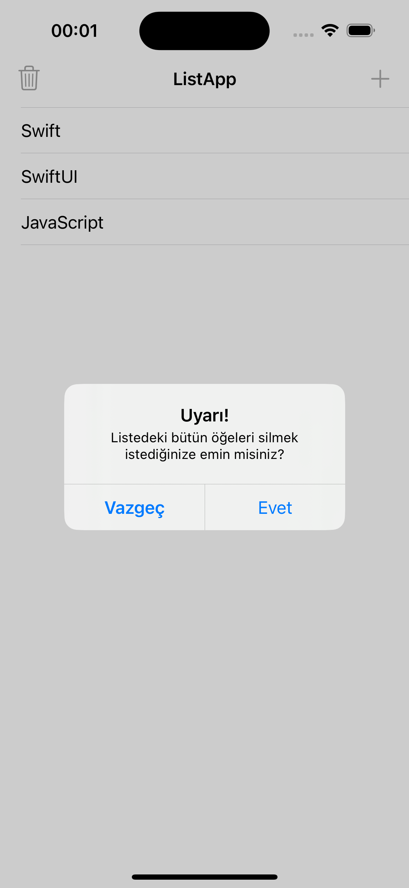

# List App

<details close>
  <summary>Uygulamaya ait ekran görüntülerini görmek için tıklayın.</summary>
      
</details>

## Teknoloji

Swift

## Tools

- Core Data
- Table View
- Alert Action

## Özellikler

- Listeye veri ekleyebilmek, silebilmek ve düzenleyebilmek.
- Verilerin core data ile telefonun hafızasında saklanabilmesi.

## Kurulum

Bu depoyu yerel makinenizde klonlayın.

```
git clone https://github.com/ibrahimaykutbas/list-app.git
```

### Hazırlık

Projeyi klonladıktan sonra ilgili dizine gidin.

```
cd list-app
open ListApp.xcodeproj
```

Bu talimatlar, geliştirme ve test amacıyla yerel makinenizde projenin bir kopyasını hazır hale getirecektir.
